# Hi there, I'm Pasang Gyalzen Sherpa 👋

  

  📠<strong>BSc (Hons) Computer Science (Data Science) Graduate</strong> 
  🫠Herald College Kathmandu | 📚 University of Wolverhampton 
  💻 Aspiring Data Scientist | .NET & Python Developer

  

---

## 🚀 About Me

I'm a tech enthusiast with a strong academic foundation in **Computer Science**, specialized in **Data Science**. I studied at **Herald College Kathmandu**, affiliated with the **University of Wolverhampton**, where I explored everything from software development to machine learning.

My current focus is on combining my development background in **.NET, C#, SQL** with my passion for **data science and AI** to build impactful, real-world solutions.

### 🎯 Current Focus:
- 🔍 Seeking entry-level data science opportunities
- 📊 Building real-world data analysis projects
- 🤖 Exploring advanced machine learning techniques
- 🌐 Contributing to open-source data science projects

---

## 🛠️ Tech Stack & Tools

### 💻 Languages

  
  
  
  

### 🚀 Frameworks

  
  

### 📊 Data Tools

  
  
  
  
  

### 🤖 ML & DS

  
  
  
  

---

## 🎨 Tech Visualization

  

*Coding • Data Science • Machine Learning*

---

## 🚀 Featured Projects

| Project | Description | Technologies | Link |
|---------|-------------|--------------|------|
| 🏥 **TeleMedicineApp** | Full-stack telehealth platform with video consultations, appointment scheduling, and prescriptions | ASP.NET Core, C#, SQL Server | [View Repo](https://github.com/pasangyalzen/telemedicine-app) |
| 📊 **FreeCodeCamp Data Notes** | Jupyter notebooks and project-based learning from FreeCodeCamp's Data Science content | Python, Pandas, Matplotlib, Jupyter | [View Repo](https://github.com/pasangyalzen/freecodecamp-data-notes) |
| 🤖 **AI & ML Coursework** | Course-based ML experiments: decision trees, random forests, CNN vs RNN, and more | Python, Scikit-Learn, TensorFlow | [View Repo](https://github.com/pasangyalzen/6CS012_AI-ML_2358846) |

---

## 📚 Learning & Development

- 🎓 **FreeCodeCamp**: Data Analysis & Python for Data Science
- 🧠 **Machine Learning**: Supervised & Unsupervised Learning
- 🔍 **EDA**: Exploratory Data Analysis with real-world datasets
- 🧹 **Data Processing**: Data cleaning, preprocessing & visualization
- 🚀 **Model Deployment**: Training, evaluation, and deployment basics

---

## 🎯 Goals for 2025

```mermaid
graph LR
    A[🔍 Land Data Science Role] --> B[📊 Build Data Dashboards]
    B --> C[🤝 Open Source Contributions]
    C --> D[📂 Expand ML Portfolio]
    
    style A fill:#667eea,stroke:#333,stroke-width:2px,color:#fff
    style B fill:#764ba2,stroke:#333,stroke-width:2px,color:#fff
    style C fill:#f093fb,stroke:#333,stroke-width:2px,color:#fff
    style D fill:#f5576c,stroke:#333,stroke-width:2px,color:#fff
```

---

## 📈 GitHub Analytics

  

  
  

  

  

---

## 🏆 GitHub Trophies

  

---

## 📫 Connect with Me

---

  
### 💭 *"Data is a tool for creating clarity."*

---

  

